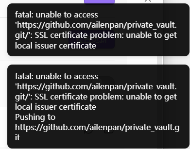
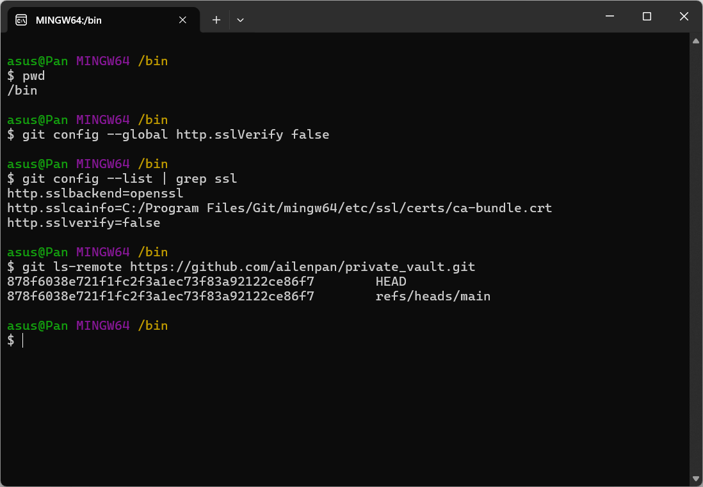

# 步骤
#### 1. 下载Obsidian、GitHubDesktop
#### 2. github创建私人仓库
#### 3. github desktop操作
   - ##### File->clone->选择建立的私人仓库添加到自定义路径
   - ##### 本地文件管理私人仓库的根目录
     添加文件 .gitignore
	     .obsidian/workspace.json
	     .obsidian/workspace-mobile.json 
   - ##### github dekstop中选中所有Changes
   - ##### 填写summary(required),点击Commit to main
   - ##### 点击publish branch
#### 4. Obsidian操作
   - ##### 打开本地仓库->选择克隆仓库
   - ##### 设置->第三方插件->关闭安全模式->社区插件市场
   - ##### 安装Git、CustomAttachmentLocation
   - ##### Git选项
     - 打开 Auto commit and sync after stopping file edits
     - 设置同步间隔时间 Auto commit and sync interval(minutes)
     - 打开Pull on startup ，在打开软件时自动更新内容
   - ##### CustomAttachmentLocation选项(处理图片格式，使兼容)
     - Markdown URL格式
       assets/${noteFileName}/${generatedAttachmentFileName}
     - 附件重命名格式
       仅粘贴的图片->全部
     - 是否重命名附件文件->开启
   - ##### 系统设置
     - 文件与链接/Links
       使用wiki链接->关闭
       内部链接类型->基于当前笔记的相对路径

# error修复

#### 1. 打开git/bin/bash.exe

#### 2. Git 插件设置
- Custom Git binary path:
	C:\Program Files\Git\bin\git.exe
- Additional environment variables:
	GIT_SSL_NO_VERIFY=true
- Custom base path:
	.（单个点号，表示当前目录）

- Custom Git directory path:
	.git
- 点击Reload
- 重启Obsidian