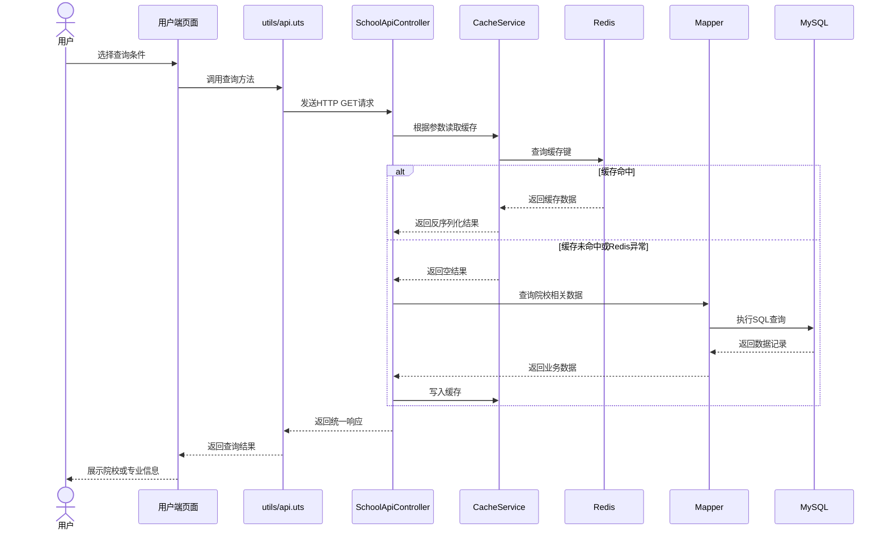
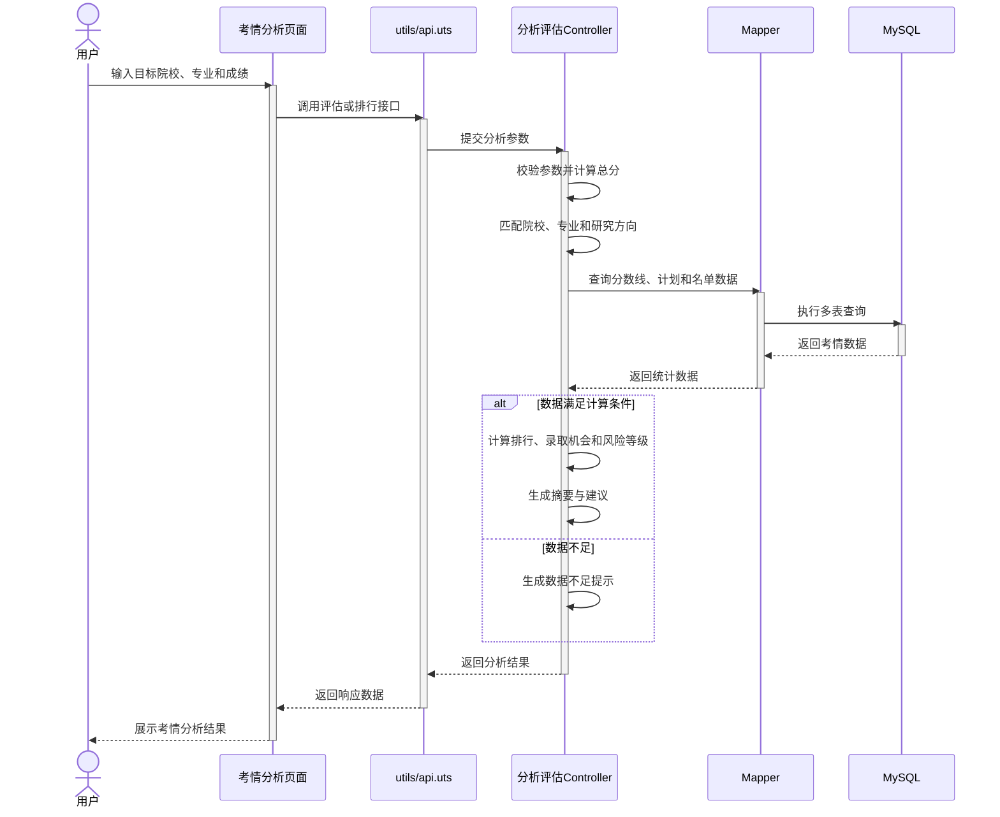
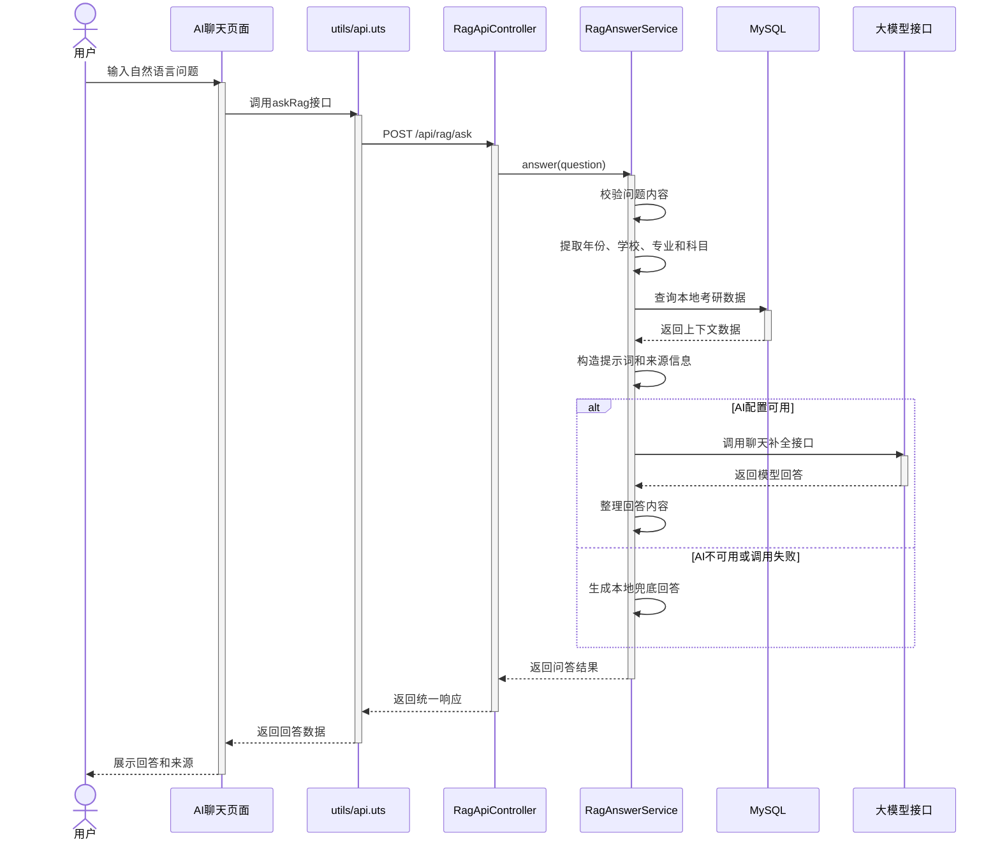
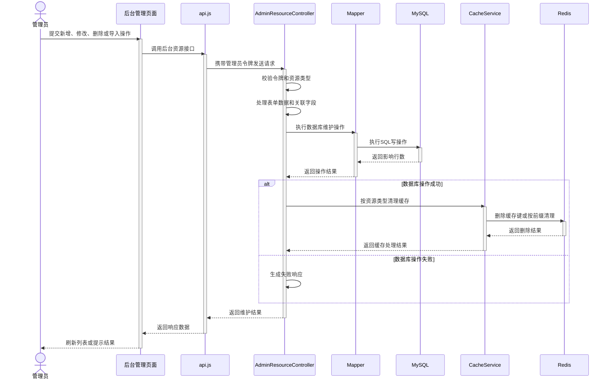

图4-2

```mermaid
sequenceDiagram
    actor 用户
    participant 页面 as 用户端页面
    participant API as utils/api.uts
    participant Controller as SchoolApiController
    participant Cache as CacheService
    participant Redis
    participant Mapper
    participant MySQL

    用户->>页面: 选择查询条件
    页面->>API: 调用查询方法
    API->>Controller: 发送HTTP GET请求
    Controller->>Cache: 根据参数读取缓存
    Cache->>Redis: 查询缓存键

    alt 缓存命中
        Redis-->>Cache: 返回缓存数据
        Cache-->>Controller: 返回反序列化结果
    else 缓存未命中或Redis异常
        Cache-->>Controller: 返回空结果
        Controller->>Mapper: 查询院校相关数据
        Mapper->>MySQL: 执行SQL查询
        MySQL-->>Mapper: 返回数据记录
        Mapper-->>Controller: 返回业务数据
        Controller->>Cache: 写入缓存
    end

    Controller-->>API: 返回统一响应
    API-->>页面: 返回查询结果
    页面-->>用户: 展示院校或专业信息
```

图4-4

```mermaid
sequenceDiagram
    actor 用户
    participant Page as 考情分析页面
    participant API as utils/api.uts
    participant Controller as 分析评估Controller
    participant Mapper as Mapper
    participant MySQL as MySQL

    用户->>Page: 输入目标院校、专业和成绩
    activate Page
    Page->>API: 调用评估或排行接口
    activate API
    API->>Controller: 提交分析参数
    activate Controller

    Controller->>Controller: 校验参数并计算总分
    Controller->>Controller: 匹配院校、专业和研究方向
    Controller->>Mapper: 查询分数线、计划和名单数据
    activate Mapper
    Mapper->>MySQL: 执行多表查询
    activate MySQL
    MySQL-->>Mapper: 返回考情数据
    deactivate MySQL
    Mapper-->>Controller: 返回统计数据
    deactivate Mapper

    alt 数据满足计算条件
        Controller->>Controller: 计算排行、录取机会和风险等级
        Controller->>Controller: 生成摘要与建议
    else 数据不足
        Controller->>Controller: 生成数据不足提示
    end

    Controller-->>API: 返回分析结果
    deactivate Controller
    API-->>Page: 返回响应数据
    deactivate API
    Page-->>用户: 展示考情分析结果
    deactivate Page
```

图4-6

```mermaid
sequenceDiagram
    actor 用户
    participant Page as AI聊天页面
    participant API as utils/api.uts
    participant Controller as RagApiController
    participant Service as RagAnswerService
    participant MySQL as MySQL
    participant LLM as 大模型接口

    用户->>Page: 输入自然语言问题
    activate Page
    Page->>API: 调用askRag接口
    activate API
    API->>Controller: POST /api/rag/ask
    activate Controller
    Controller->>Service: answer(question)
    activate Service

    Service->>Service: 校验问题内容
    Service->>Service: 提取年份、学校、专业和科目
    Service->>MySQL: 查询本地考研数据
    activate MySQL
    MySQL-->>Service: 返回上下文数据
    deactivate MySQL
    Service->>Service: 构造提示词和来源信息

    alt AI配置可用
        Service->>LLM: 调用聊天补全接口
        activate LLM
        LLM-->>Service: 返回模型回答
        deactivate LLM
        Service->>Service: 整理回答内容
    else AI不可用或调用失败
        Service->>Service: 生成本地兜底回答
    end

    Service-->>Controller: 返回问答结果
    deactivate Service
    Controller-->>API: 返回统一响应
    deactivate Controller
    API-->>Page: 返回回答数据
    deactivate API
    Page-->>用户: 展示回答和来源
    deactivate Page
```

图4-8

```mermaid
sequenceDiagram
    actor 管理员
    participant Page as 后台管理页面
    participant API as api.js
    participant Controller as AdminResourceController
    participant Mapper as Mapper
    participant MySQL as MySQL
    participant Cache as CacheService
    participant Redis as Redis

    管理员->>Page: 提交新增、修改、删除或导入操作
    activate Page
    Page->>API: 调用后台资源接口
    activate API
    API->>Controller: 携带管理员令牌发送请求
    activate Controller

    Controller->>Controller: 校验令牌和资源类型
    Controller->>Controller: 处理表单数据和关联字段
    Controller->>Mapper: 执行数据库维护操作
    activate Mapper
    Mapper->>MySQL: 执行SQL写操作
    activate MySQL
    MySQL-->>Mapper: 返回影响行数
    deactivate MySQL
    Mapper-->>Controller: 返回操作结果
    deactivate Mapper

    alt 数据库操作成功
        Controller->>Cache: 按资源类型清理缓存
        activate Cache
        Cache->>Redis: 删除缓存键或按前缀清理
        activate Redis
        Redis-->>Cache: 返回删除结果
        deactivate Redis
        Cache-->>Controller: 返回缓存处理结果
        deactivate Cache
    else 数据库操作失败
        Controller->>Controller: 生成失败响应
    end

    Controller-->>API: 返回维护结果
    deactivate Controller
    API-->>Page: 返回响应数据
    deactivate API
    Page-->>管理员: 刷新列表或提示结果
    deactivate Page
```
